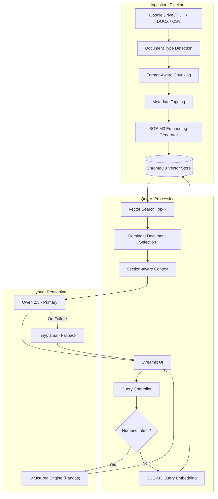

# GenAI RAG System – Design, Implementation & Architecture Phase

## Overview

This repository contains the implementation of a Retrieval-Augmented Generation (RAG) based document querying system developed during an advanced internship project.

The system has evolved from a basic RAG prototype into a multi-format, hybrid-reasoning architecture capable of ingesting structured and unstructured documents from Google Drive, performing format-aware chunking, generating semantic embeddings, and producing grounded responses using both structured computation and LLM-based reasoning.

The project is now focused on architecture refinement, structured reasoning enhancement, and deployment readiness.

Current focus areas:

- Hybrid structured + LLM reasoning
- Format-aware adaptive chunking
- Retrieval robustness improvements
- Architecture hardening
- Production-ready deployment planning

---

## System Capabilities

### 1. End-to-End RAG Pipeline

- Google Drive ingestion via Drive API
- Multi-format document extraction
- Format-aware chunking strategy selection
- BGE-M3 embedding generation
- Persistent vector storage using ChromaDB
- Semantic similarity retrieval with scoring
- Dominant-document selection logic
- Section-aware context construction
- Hybrid reasoning pipeline:
  - Structured CSV numeric reasoning
  - LLM-based contextual reasoning
- Automatic fallback LLM support
- Streamlit-based chat interface
- Source attribution included in responses
- Detailed retrieval logging for explainability

---

## Supported Input Formats

| Format        | Extraction Method       | Chunking Strategy         | Reasoning Mode |
|--------------|------------------------|---------------------------|----------------|
| Google Docs  | Drive API extraction   | Paragraph-based           | LLM            |
| DOCX         | python-docx            | Paragraph-based           | LLM            |
| PDF          | PyMuPDF                | Paragraph-based           | LLM            |
| CSV          | Pandas parsing         | Row-based structured text | Hybrid (Structured + LLM fallback) |

---

## Hybrid CSV Structured Reasoning

The system now includes structured reasoning support for CSV files.

For CSV queries, the pipeline:

- Detects numeric intent:
  - Maximum
  - Minimum
  - Average
  - Sum
  - Count
- Automatically detects the most relevant column
- Performs deterministic row-level computation using Pandas
- Applies date-aware formatting when applicable
- Bypasses LLM for purely numeric structured queries
- Falls back to LLM when structured reasoning is not applicable

This ensures:

- Deterministic numeric answers
- No hallucinated calculations
- Improved reliability for structured datasets
- Clean separation between retrieval and computation logic

---

## Format-Aware Chunking

The ingestion pipeline dynamically selects chunking strategies depending on document type:

- Paragraph-based chunking for Google Docs, DOCX, and PDF files
- Row-based chunking for CSV files

This approach:

- Preserves semantic integrity
- Prevents cross-section contamination
- Improves retrieval precision
- Enhances grounding consistency

---

## Retrieval Improvements

The system incorporates several retrieval optimizations:

- Upgraded embeddings to BGE-M3 for improved query-document alignment
- Migrated from token-based chunking to paragraph-based chunking
- Implemented dominant-document selection using:
  - Vector similarity scoring
  - Keyword overlap scoring (document-level filtering only)
- Section-aware context grouping
- Reduced cross-document context mixing
- Structured reasoning bypass for CSV numeric queries
- Enhanced logging for explainable retrieval decisions

Results:

- Improved grounding accuracy
- Reduced hallucination risk
- Better performance on documents with overlapping terminology
- Deterministic structured responses for CSV datasets

---

## Current Architecture (High-Level)

Google Drive  
→ Text Extraction  
→ Format-Aware Chunking  
→ BGE-M3 Embeddings  
→ ChromaDB (Persistent Vector Store)  
→ Semantic Retrieval  
→ Dominant Document Filtering  
→ Section-Aware Context Construction  
→ Hybrid Reasoning Layer  
&nbsp;&nbsp;&nbsp;&nbsp;• Structured CSV Computation (Pandas)  
&nbsp;&nbsp;&nbsp;&nbsp;• LLM Reasoning (Primary + Fallback via Ollama)  
→ Streamlit UI  

---

## Technical Stack

- Python
- Google Drive API
- PyMuPDF (PDF extraction)
- python-docx
- Pandas (Structured CSV reasoning)
- SentenceTransformers (BGE-M3)
- ChromaDB
- Ollama (Local LLM)
- Streamlit
- SQLite (Tracker DB)

---

## Current Focus

- Improving retrieval robustness for overlapping terminology across documents
- Refining numeric intent detection for structured queries
- Strengthening dominant-document selection logic
- Refactoring toward API-first backend (FastAPI)
- Designing production-grade system architecture
- Exploring cost-efficient deployment strategies (cloud storage + containerized inference services)

---

## Next Steps

- Refactor backend into FastAPI for scalable API-based serving
- Modularize hybrid reasoning layer
- Add adaptive chunk sizing heuristics
- Implement evaluation metrics for retrieval and grounding
- Design full production architecture diagram
- Plan cost-efficient deployment (cloud storage + scalable inference layer)
- Introduce monitoring and logging improvements for production readiness

---

## Repository Status

The project is currently in an advanced Proof-of-Concept stage with:

- Stable multi-format ingestion
- Robust semantic retrieval
- Hybrid structured + LLM reasoning
- Deterministic CSV numeric computation
- Grounded response generation with source attribution

The next phase focuses on:

- Architecture hardening
- Deployment design
- Scalability improvements
- Production-readiness enhancements

---

## Low-Level Architecture – Hybrid RAG System

