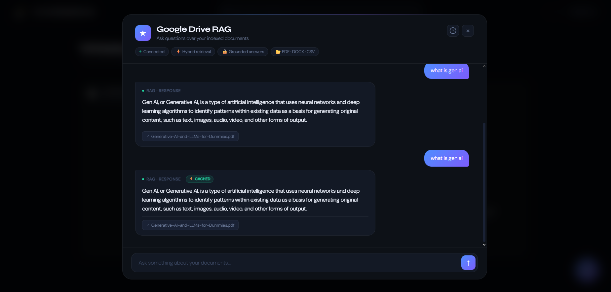
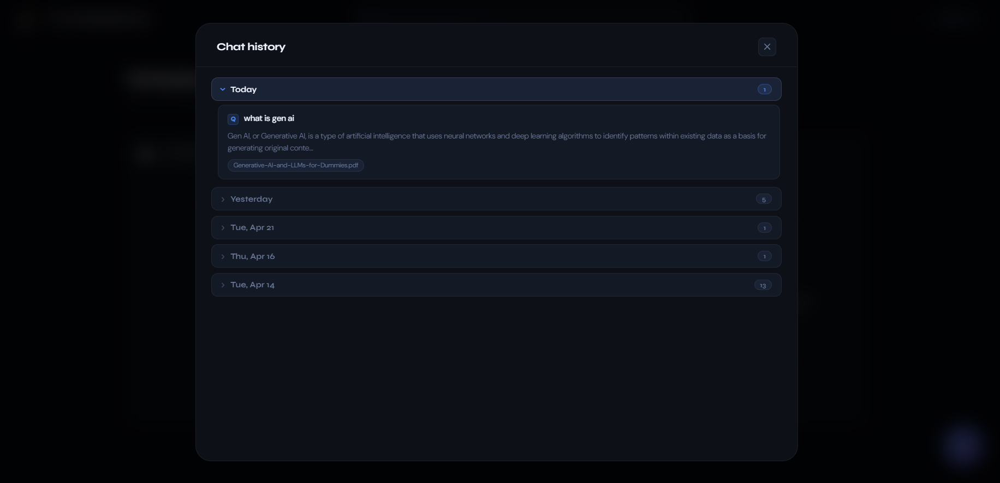

# GenAI RAG System

A production-grade Retrieval-Augmented Generation platform built during an EY internship. Enables users to query documents stored in Google Drive through a conversational interface, receiving grounded, cited answers backed by actual document content — not model memory.

The platform extends beyond the core RAG engine into KnowledgeVerse — a multi-panel dashboard with real-time document search, user activity tracking, chat history, and response caching, deployed on Render Cloud via Docker.

Live deployment: https://genai-rag-system-3.onrender.com

---

## Table of Contents

- [Platform Overview](#platform-overview)
- [Architecture](#architecture)
- [Features](#features)
- [Technical Stack](#technical-stack)
- [Project Structure](#project-structure)
- [Local Setup](#local-setup)
- [Environment Variables](#environment-variables)
- [Running the Application](#running-the-application)
- [Running Ingestion](#running-ingestion)
- [Utility Scripts](#utility-scripts)
- [Deployment](#deployment)
- [GitHub Actions — Scheduled Ingestion](#github-actions--scheduled-ingestion)
- [Backup and Recovery](#backup-and-recovery)
- [API Reference](#api-reference)
- [Supported Document Formats](#supported-document-formats)
- [System Design Decisions](#system-design-decisions)
- [Known Limitations](#known-limitations)

---

## Platform Overview

| Attribute | Value |
|---|---|
| Deployment | Render Cloud via Docker containers |
| Live URL | https://genai-rag-system-3.onrender.com |
| Supported Formats | PDF (text, scanned, chart-heavy, tables), DOCX, CSV |
| Retrieval Strategy | Hybrid dense + BM25 + Reciprocal Rank Fusion (RRF) |
| LLM Routing | Dynamic selection across Llama 3.3 70B, GPT-4o Mini, Claude Haiku |
| Ingestion Automation | Daily scheduled pipeline via GitHub Actions at 3:00 AM IST |
| Orchestration | LangGraph graph-based execution with conditional routing |
| Backup | Full index restoration from Google Drive on every cold start |
| Dashboard | KnowledgeVerse — Latest Documents, Frequently Visited, Recent Activity |
| Search | Real-time prefix search with live dropdown suggestions |
| Analytics | User behavior tracking, click logging, query history |

---

## Architecture

The system is organised into six independently operating layers.

```
Google Drive
      |
      v
GitHub Actions  ----  Daily Ingestion (3:00 AM IST)
      |
      v
pipeline/ingestion/       Document discovery + format detection
pipeline/parsers/         Format-aware extraction (pdfplumber / Gemini Vision OCR / python-docx / Pandas)
pipeline/chunking/        Adaptive chunking per document type
pipeline/embedding/       Embedding generation (BAAI/bge-small-en-v1.5 via HuggingFace)
pipeline/storage/         Qdrant Cloud (vectors) + SQLite tracker.db (metadata, analytics, cache)
      |
      v
Drive Backup  (sqlite_latest.pkl.gz + Qdrant snapshot)  -->  backups/
      |
      v
Render Cloud  --  Docker container  (FastAPI backend + React.js frontend)
      |
      v
pipeline/orchestration/langgraph_pipeline.py  (LangGraph StateGraph)
      |
      +-- Cache Check Node
      +-- Query Classification Node
      +-- Query Rewriting Node          pipeline/utils/query_rewriter.py
      +-- Hybrid Retrieval Node         pipeline/providers/retrievers/
      +-- Cross-Encoder Reranking Node  pipeline/utils/cross_encoder_reranker.py
      +-- Diversity Filter Node
      +-- LLM Generation Node           pipeline/llm/
      +-- Activity Log Node             pipeline/storage/tracker_db.py
      |
      v
Response  (grounded answer + source attribution + CACHED badge if applicable)
      |
      v
backend/api.py  (FastAPI REST endpoints)
      |
      v
frontend/src/  (React.js — KnowledgeVerse dashboard + chat interface)
```

### Layer Summary

| Layer | Purpose |
|---|---|
| Data Sources and Ingestion | Discovers documents in Google Drive, extracts content by format, chunks text, writes embeddings to vector store |
| Storage | Qdrant Cloud for vector embeddings; SQLite for metadata, CSV data, analytics, and response cache |
| Query and Retrieval | Classifies queries, routes to structured or semantic path, retrieves content, generates grounded answers |
| Frontend and API | React.js KnowledgeVerse dashboard and chat interface; FastAPI REST endpoints in backend/api.py |
| Backup and Recovery | Snapshots index and database to Google Drive after every ingestion; restores automatically on startup |
| User Interaction and Analytics | Tracks document access events, query history, and user sessions; powers dashboard panels |

---

## Features

### KnowledgeVerse Dashboard

The primary entry point into the platform. Provides three live data panels driven by real system state.

| Panel | Data Source | Behaviour |
|---|---|---|
| Latest Documents | SQLite ingestion timestamp | Shows 5 most recently ingested files with clickable Google Drive links. Auto-updates after each nightly ingestion cycle. |
| Frequently Visited | SQLite access_log table | Lists document access events with user session ID and clickable file links. Reflects real-time click behaviour across all users. |
| Recent Activity | SQLite query_log table | Shows the latest 5 queries with query text, source document cited, and session ID. |

### Real-Time Document Search

Prefix-based search in the dashboard header. Each keystroke issues a request to `/search-documents`, which performs a prefix match against all indexed file names and returns a live dropdown. Selecting a result opens the document directly in Google Drive.

### RAG Chat Interface

Users submit natural-language questions and receive grounded, cited answers. The interface shows the source document for every response and displays a CACHED badge when a repeated query is served from cache.

### Chat History

Persistent query history grouped by date — Today, Yesterday, and prior dated sections. Each entry shows the query text, a truncated response preview, and the source document. History persists across sessions per user session ID.

### Response Caching

Repeated queries bypass the full retrieval and LLM pipeline and return instantly with a CACHED badge. Cache entries are stored in the SQLite `response_cache` table.

### Query Routing

The LangGraph pipeline (`pipeline/orchestration/langgraph_pipeline.py`) classifies each query and routes it to one of two execution paths:

- Semantic path — hybrid dense + BM25 retrieval, cross-encoder reranking, LLM generation
- Structured path — deterministic Pandas computation from SQLite for CSV numerical queries; no LLM involved in the computation itself

### Multi-Model LLM Routing

Routing logic is implemented in `pipeline/llm/llm_router.py`.

| Model | Provider | Use Case |
|---|---|---|
| Llama 3.3 70B | Groq | General question answering |
| GPT-4o Mini | OpenRouter | Summarisation queries |
| Claude Haiku | OpenRouter | Complex reasoning queries |

---

## Technical Stack

| Component | Technology |
|---|---|
| Language runtime | Python 3.11 |
| Backend framework | FastAPI |
| Frontend | React.js |
| Containerisation | Docker |
| Deployment | Render Cloud |
| Scheduler | GitHub Actions |
| Query orchestration | LangGraph |
| Vector store | Qdrant Cloud |
| Metadata and structured store | SQLite (data/runtime/tracker.db) |
| Analytics tables | SQLite extended (access_log, query_log, latest_documents, response_cache) |
| Embedding model | BAAI/bge-small-en-v1.5 |
| Embedding provider | HuggingFace Inference Router |
| Sparse retrieval | BM25 (index at data/indices/bm25_index.pkl) |
| Fusion algorithm | Reciprocal Rank Fusion (RRF) |
| Reranker | cross-encoder/ms-marco-MiniLM-L-6-v2 |
| PDF parsing | pdfplumber, pdfminer.six, PyMuPDF |
| Vision OCR | Gemini Vision Flash |
| DOCX parsing | python-docx |
| Structured processing | Pandas |
| Primary LLM | Llama 3.3 70B via Groq |
| Summarisation LLM | GPT-4o Mini via OpenRouter |
| Reasoning LLM | Claude Haiku via OpenRouter |
| Backup storage | Google Drive |

---

## Project Structure

```
genai-rag-system/
|
|-- backend/
|   |-- api.py                          # FastAPI application — all REST endpoints
|   |-- session_manager.py              # Browser session ID management
|
|-- frontend/
|   |-- public/
|   |   |-- index.html
|   |   |-- favicon.ico
|   |-- src/
|   |   |-- assets/
|   |   |   |-- ey-logo.png
|   |   |-- components/
|   |   |   |-- ChatOverlay.js          # RAG chat interface component
|   |   |-- pages/
|   |   |   |-- Dashboard.js            # KnowledgeVerse dashboard page
|   |   |   |-- LandingPage.js          # Landing page
|   |   |-- App.js                      # Root React component + routing
|   |   |-- App.css
|   |   |-- Dashboard.css
|   |   |-- index.js                    # React entry point
|   |   |-- index.css
|   |-- package.json
|   |-- package-lock.json
|
|-- pipeline/
|   |-- chunking/
|   |   |-- chunker.py                  # Chunking entry point
|   |   |-- chunking_router.py          # Routes to format-specific chunker
|   |   |-- chunk_csv.py
|   |-- embedding/
|   |   |-- vector_store.py             # Qdrant write and query interface
|   |-- ingestion/
|   |   |-- main.py                     # Ingestion pipeline entry point
|   |   |-- list_docs.py                # Google Drive file discovery
|   |   |-- download_file.py            # File download from Drive
|   |-- interfaces/
|   |   |-- base_chunker.py             # Abstract base classes
|   |   |-- base_embedder.py
|   |   |-- base_llm.py
|   |   |-- base_parser.py
|   |   |-- base_retreiver.py
|   |   |-- base_vector_store.py
|   |-- llm/
|   |   |-- llm_router.py               # Multi-model LLM routing logic
|   |   |-- rag.py                      # RAG prompt construction and generation
|   |   |-- structure.py                # Structured CSV query handler
|   |-- orchestration/
|   |   |-- langgraph_pipeline.py       # LangGraph StateGraph definition
|   |-- parsers/
|   |   |-- extract_pdf.py
|   |   |-- extract_docx.py
|   |   |-- extract_csv.py
|   |   |-- extract_text.py
|   |   |-- vision_extractor.py         # Gemini Vision OCR for scanned PDFs
|   |-- providers/
|   |   |-- chunking/
|   |   |   |-- chunking_router.py
|   |   |   |-- pdf_chunker.py
|   |   |   |-- paragraph_chunker.py
|   |   |   |-- csv_chunker.py
|   |   |-- embeddings/
|   |   |   |-- bge_embedder.py         # BAAI/bge-small-en-v1.5 via HuggingFace
|   |   |-- llm/
|   |   |   |-- groq_llm.py
|   |   |   |-- openrouter_llm.py
|   |   |   |-- gemini_llm.py
|   |   |-- parsers/
|   |   |   |-- pdf_parser.py
|   |   |   |-- docx_parser.py
|   |   |   |-- csv_parser.py
|   |   |   |-- google_doc_parser.py
|   |   |   |-- parser_router.py
|   |   |-- retrievers/
|   |       |-- hybrid_retriever.py     # Dense + BM25 + RRF fusion
|   |       |-- bm25_retriever.py
|   |-- scheduler/
|   |   |-- sync_scheduler.py
|   |-- sources/
|   |   |-- drive_source.py             # Google Drive document source
|   |   |-- azure_blob_source.py        # Azure Blob (future source layer)
|   |   |-- base.py
|   |-- storage/
|   |   |-- sqlite_store.py             # SQLite read/write operations
|   |   |-- tracker_db.py               # Analytics tables: access_log, query_log, etc.
|   |-- utils/
|       |-- auth.py                     # Google service account authentication
|       |-- cross_encoder_reranker.py   # ms-marco-MiniLM-L-6-v2 reranking
|       |-- query_rewriter.py           # LLM-based query expansion
|       |-- logger.py
|       |-- metrics.py
|
|-- scripts/
|   |-- run/
|   |   |-- run_daily_sync.py           # Full ingestion pipeline trigger
|   |   |-- run_pipeline.py             # Single-run pipeline execution
|   |-- backup/
|   |   |-- backup_qdrant.py            # Qdrant snapshot creation
|   |   |-- backup_sqlite.py            # SQLite compression and serialisation
|   |   |-- upload_backup_to_drive.py   # Upload backups to Google Drive
|   |-- restore/
|   |   |-- restore_sqlite_from_drive.py  # Download and restore SQLite from Drive
|   |-- debug/
|       |-- check_tracker.py            # Inspect SQLite tracker state
|       |-- check_vector_count.py       # Verify Qdrant collection size
|       |-- clear_qdrant.py             # Clear Qdrant collection (use with caution)
|
|-- data/
|   |-- indices/
|   |   |-- bm25_index.pkl              # Serialised BM25 index (rebuilt at startup)
|   |-- runtime/
|       |-- tracker.db                  # Primary SQLite database
|       |-- csv_store.db                # Structured CSV data for deterministic queries
|
|-- backups/
|   |-- qdrant_latest.snapshot          # Most recent Qdrant collection snapshot
|   |-- sqlite_latest.db                # Most recent SQLite backup (raw)
|   |-- sqlite_latest.pkl.gz            # Most recent SQLite backup (compressed)
|
|-- .github/
|   |-- workflows/
|       |-- daily_pipeline.yml          # Scheduled GitHub Actions ingestion workflow
|
|-- Dockerfile
|-- render.yaml                         # Render Cloud deployment configuration
|-- requirements.txt                    # Python dependencies (root level)
|-- runtime.txt                         # Python version for Render
|-- .env                                # Local environment variables (not committed)
|-- README.md
```

---

## Local Setup

### Prerequisites

- Python 3.11
- Node.js 18 or later
- A Google Cloud service account with Google Drive API enabled
- Qdrant Cloud account and cluster
- API keys for Groq, OpenRouter, and HuggingFace

### 1. Clone the Repository

```bash
git clone https://github.com/your-username/genai-rag-system.git
cd genai-rag-system
```

### 2. Create and Activate a Virtual Environment

```bash
python -m venv venv

# Linux / macOS
source venv/bin/activate

# Windows
venv\Scripts\activate
```

### 3. Install Python Dependencies

```bash
pip install -r requirements.txt
```

The `requirements.txt` at the project root includes `--extra-index-url https://download.pytorch.org/whl/cpu` to install the CPU-only build of PyTorch. This is intentional for cloud deployment on Render. Do not remove this line.

### 4. Install Tesseract (required for scanned PDF OCR)

Tesseract is a system-level dependency required by `pytesseract`. It is not installed via pip.

Ubuntu / Debian:
```bash
sudo apt-get update && sudo apt-get install -y tesseract-ocr
```

macOS:
```bash
brew install tesseract
```

Windows: Download and install from https://github.com/UB-Mannheim/tesseract/wiki

### 5. Install poppler (required for pdf2image)

Ubuntu / Debian:
```bash
sudo apt-get install -y poppler-utils
```

macOS:
```bash
brew install poppler
```

Windows: Download from https://github.com/oschwartz10612/poppler-windows/releases and add the `bin/` directory to your system PATH.

### 6. Install Frontend Dependencies

```bash
cd frontend
npm install
cd ..
```

---

## Environment Variables

Create a `.env` file in the project root and fill in all values:

```env
# Groq — primary LLM (Llama 3.3 70B)
GROQ_API_KEY=your_groq_api_key

# OpenRouter — GPT-4o Mini (summarisation) and Claude Haiku (reasoning)
OPENROUTER_API_KEY=your_openrouter_api_key

# HuggingFace — embedding inference via Inference Router
HF_API_KEY=your_huggingface_api_key

# Qdrant Cloud — vector store
QDRANT_URL=https://your-cluster-url.qdrant.io
QDRANT_API_KEY=your_qdrant_api_key

# Google Drive — service account credentials as a single-line JSON string
GOOGLE_SERVICE_ACCOUNT_JSON={"type":"service_account","project_id":"..."}
```

For `GOOGLE_SERVICE_ACCOUNT_JSON`, paste the entire contents of your service account JSON key file as a single-line string. The application parses this value at runtime via `pipeline/utils/auth.py`.

### Google Drive Setup

1. Create a Google Cloud project at https://console.cloud.google.com
2. Enable the Google Drive API for the project
3. Go to IAM and Admin > Service Accounts and create a service account
4. Download the JSON key file for the service account
5. Share your target Google Drive folder with the service account email address, granting at minimum Viewer access
6. Paste the full JSON contents into `GOOGLE_SERVICE_ACCOUNT_JSON` in your `.env`

---

## Running the Application

### Start the FastAPI Backend

From the project root:

```bash
uvicorn backend.api:app --host 0.0.0.0 --port 8000 --reload
```

The API will be available at `http://localhost:8000`.

Interactive API documentation is available at `http://localhost:8000/docs`.

### Start the React Frontend

In a separate terminal:

```bash
cd frontend
npm start
```

The frontend development server will be available at `http://localhost:3000`.

In production, the Docker container serves the built React frontend as static files through the FastAPI backend from a single service on port 8501. The `npm start` command is for local development only.

---

## Running Ingestion

Ingestion processes all new and modified documents from Google Drive, generates embeddings, updates the vector store and SQLite database, and uploads a backup to Drive.

### Run Full Ingestion

From the project root:

```bash
python scripts/run/run_daily_sync.py
```

This executes the full pipeline:

1. Connects to Google Drive via the service account in `pipeline/utils/auth.py`
2. Detects new or modified files since the last run using Drive modification timestamps tracked in SQLite
3. Routes each file to the appropriate parser in `pipeline/providers/parsers/`
4. Chunks extracted text using format-aware strategies in `pipeline/providers/chunking/`
5. Generates 384-dimensional embeddings via `pipeline/providers/embeddings/bge_embedder.py`
6. Writes vector embeddings to Qdrant Cloud via `pipeline/embedding/vector_store.py`
7. Writes structured CSV data and document metadata to SQLite via `pipeline/storage/`
8. Updates the `latest_documents` table in `data/runtime/tracker.db`
9. Compresses `tracker.db` and uploads `sqlite_latest.pkl.gz` to Google Drive
10. Creates a Qdrant collection snapshot and uploads it to Google Drive

Ingestion is incremental. Files unchanged since the last run are skipped automatically.

### Run Pipeline for a Single File

```bash
python scripts/run/run_pipeline.py
```

---

## Utility Scripts

All utility scripts are in `scripts/` and are intended for operational use only. They do not contain core logic, which lives entirely in `pipeline/`.

### Backup Scripts

Manually create and upload backups:

```bash
# Create and compress a SQLite backup
python scripts/backup/backup_sqlite.py

# Create a Qdrant collection snapshot
python scripts/backup/backup_qdrant.py

# Upload existing backups from backups/ to Google Drive
python scripts/backup/upload_backup_to_drive.py
```

### Restore Scripts

Restore SQLite from the latest Google Drive backup:

```bash
python scripts/restore/restore_sqlite_from_drive.py
```

### Debug Scripts

Inspect system state during development:

```bash
# Print the current contents of tracker.db
python scripts/debug/check_tracker.py

# Print the current number of vectors in the Qdrant collection
python scripts/debug/check_vector_count.py

# Clear all vectors from the Qdrant collection (irreversible without a backup)
python scripts/debug/clear_qdrant.py
```

---

## Deployment

The application is deployed on Render Cloud using Docker. The image packages the FastAPI backend and the production build of the React frontend into a single container exposed on port 8501. Render configuration is defined in `render.yaml`.

### Build the Docker Image Locally

```bash
docker build -t genai-rag-system .
```

### Run the Docker Container Locally

```bash
docker run --env-file .env -p 8501:8501 genai-rag-system
```

The application will be available at `http://localhost:8501`.

### Deploy to Render

1. Push the repository to GitHub
2. Go to https://render.com and create a new Web Service
3. Connect your GitHub repository
4. Render will detect `render.yaml` automatically and apply the configuration
5. Add all environment variables from your `.env` file in the Render dashboard under Environment
6. Click Deploy

On every cold start, the container automatically downloads and restores `sqlite_latest.pkl.gz` and the Qdrant snapshot from Google Drive before accepting any requests. No manual re-ingestion is required after deployment.

### Dockerfile Overview

The Dockerfile installs `tesseract-ocr` and `poppler-utils` as system dependencies, installs Python dependencies from `requirements.txt`, builds the React frontend, and starts the FastAPI server on port 8501.

```dockerfile
FROM python:3.11-slim

RUN apt-get update && apt-get install -y \
    tesseract-ocr \
    poppler-utils \
    curl \
    nodejs \
    npm \
    && rm -rf /var/lib/apt/lists/*

WORKDIR /app

COPY requirements.txt .
RUN pip install --no-cache-dir -r requirements.txt

COPY frontend/ ./frontend/
RUN cd frontend && npm install && npm run build

COPY . .

EXPOSE 8501

CMD ["uvicorn", "backend.api:app", "--host", "0.0.0.0", "--port", "8501"]
```

---

## GitHub Actions — Scheduled Ingestion

Ingestion runs automatically every day at 3:00 AM IST (21:30 UTC) via `.github/workflows/daily_pipeline.yml`.

### Setting Up Repository Secrets

Go to your repository on GitHub, navigate to Settings > Secrets and variables > Actions, and add the following secrets:

| Secret Name | Value |
|---|---|
| `GROQ_API_KEY` | Your Groq API key |
| `OPENROUTER_API_KEY` | Your OpenRouter API key |
| `HF_API_KEY` | Your HuggingFace API key |
| `QDRANT_URL` | Your Qdrant cluster URL |
| `QDRANT_API_KEY` | Your Qdrant API key |
| `GOOGLE_SERVICE_ACCOUNT_JSON` | Full contents of your service account JSON key file |

### Workflow Structure

```yaml
name: Daily Document Ingestion

on:
  schedule:
    - cron: '30 21 * * *'   # 3:00 AM IST daily
  workflow_dispatch:         # Allow manual trigger from GitHub Actions UI

jobs:
  ingest:
    runs-on: ubuntu-latest

    steps:
      - name: Checkout repository
        uses: actions/checkout@v3

      - name: Set up Python 3.11
        uses: actions/setup-python@v4
        with:
          python-version: '3.11'

      - name: Install system dependencies
        run: |
          sudo apt-get update
          sudo apt-get install -y tesseract-ocr poppler-utils

      - name: Install Python dependencies
        run: pip install -r requirements.txt

      - name: Run ingestion pipeline
        env:
          GROQ_API_KEY: ${{ secrets.GROQ_API_KEY }}
          OPENROUTER_API_KEY: ${{ secrets.OPENROUTER_API_KEY }}
          HF_API_KEY: ${{ secrets.HF_API_KEY }}
          QDRANT_URL: ${{ secrets.QDRANT_URL }}
          QDRANT_API_KEY: ${{ secrets.QDRANT_API_KEY }}
          GOOGLE_SERVICE_ACCOUNT_JSON: ${{ secrets.GOOGLE_SERVICE_ACCOUNT_JSON }}
        run: python scripts/run/run_daily_sync.py
```

### Triggering Ingestion Manually

1. Go to your repository on GitHub
2. Navigate to Actions > Daily Document Ingestion
3. Click Run workflow > Run workflow

The running Render application is not restarted when ingestion completes. Newly ingested documents appear in the KnowledgeVerse dashboard automatically after the workflow finishes writing to SQLite.

---

## Backup and Recovery

Two independent backup layers guarantee full recoverability after any environment reset.

### SQLite Backup

After every ingestion cycle, `data/runtime/tracker.db` is serialised with pickle, compressed with gzip, and uploaded to Google Drive as `sqlite_latest.pkl.gz`. A raw copy is also written to `backups/sqlite_latest.db`.

Manual backup:
```bash
python scripts/backup/backup_sqlite.py
python scripts/backup/upload_backup_to_drive.py
```

### Qdrant Backup

After every ingestion cycle, Qdrant creates a collection snapshot stored in `backups/qdrant_latest.snapshot` and uploaded to Google Drive.

Manual backup:
```bash
python scripts/backup/backup_qdrant.py
python scripts/backup/upload_backup_to_drive.py
```

### Automatic Startup Restoration

On every Render cold start, the container restores both backups before serving requests:

```
Application starts
      |
      v
Check for data/runtime/tracker.db
      |
      v
If missing: download sqlite_latest.pkl.gz from Google Drive
      |
      v
Decompress and restore to data/runtime/tracker.db
      |
      v
Restore Qdrant collection from snapshot
      |
      v
Rebuild BM25 index to data/indices/bm25_index.pkl
      |
      v
Application is ready — begins accepting requests
```

Manual restore of SQLite from Drive:
```bash
python scripts/restore/restore_sqlite_from_drive.py
```

---

## API Reference

All endpoints are served by `backend/api.py`. Interactive documentation is available at `/docs` when running locally.

| Endpoint | Method | Purpose | Returns |
|---|---|---|---|
| `/query` | POST | Core RAG query endpoint | Answer, source document, cache status |
| `/latest-documents` | GET | 5 most recently ingested documents | File names, Drive URLs, ingestion timestamps |
| `/search-documents?q={prefix}` | GET | Prefix-based document name search | Matching file names and Drive URLs |
| `/track-access` | POST | Logs a document click event for a session | Acknowledgement |
| `/recent-activity` | GET | Latest 5 queries across all users | Query text, source document, session ID |
| `/frequently-visited` | GET | Most-accessed documents across all users | File names, access counts, session IDs |

### Query Endpoint — Request Body

```json
{
  "query": "What is the objective of the dataset?",
  "session_id": "9F060AE1"
}
```

### Query Endpoint — Response Body

```json
{
  "answer": "The dataset objective is...",
  "source_document": "ExfolabAI - Dataset Description Report.docx",
  "cached": false
}
```

---

## Supported Document Formats

| Format | Extraction | Chunking Strategy | Query Type |
|---|---|---|---|
| PDF (text-based) | pdfplumber | Balanced structural chunking | Natural language |
| PDF (scanned) | Gemini Vision OCR | Page-level extraction | Natural language |
| PDF (chart-heavy) | Gemini Vision OCR | Page-level extraction | Natural language |
| PDF (embedded tables) | pdfplumber table parser | Row-aware contextual chunks | Natural language |
| DOCX | python-docx | Paragraph-based chunks | Natural language |
| CSV | Pandas | Direct SQLite storage | Numerical aggregation |

CSV queries are handled deterministically via `pipeline/llm/structure.py`. Pandas computes results directly from `data/runtime/csv_store.db` — no LLM is involved in the computation. An LLM wraps the numeric result in a readable sentence only after the value is computed. Supported operations: sum, average, min, max, count, comparisons, and filters.

---

## System Design Decisions

| Decision | Rationale |
|---|---|
| Hybrid retrieval over pure vector search | Combining dense vector search with BM25 captures both conceptual similarity and exact term matches, handling paraphrased questions and precise technical terms simultaneously. |
| Deterministic path for CSV queries | Running numerical queries through Pandas computation rather than an LLM eliminates hallucination entirely for structured data, guaranteeing reproducible results. |
| Query rewriting before retrieval | Short or vague queries often fail to match source document vocabulary. Expanding queries before retrieval improves recall without requiring users to reformulate. |
| Post-retrieval cross-encoder reranking | Retrieving a large candidate pool and reranking by relevance produces better final selections than retrieving fewer results with embedding similarity alone. |
| LangGraph for query orchestration | Implementing the query pipeline as a directed graph allows conditional branching, modular node design, and clean shared state management across all nodes. |
| Two-layer backup and boot-time recovery | Storing both the vector index snapshot and the metadata database on Google Drive ensures the system is always fully operational within seconds of a cold boot. |
| Multi-model LLM routing | No single model is optimal for all query types. Routing general QA, summarisation, and complex reasoning to different models optimises both quality and cost. |
| SQLite extended as analytics store | Rather than introducing a separate analytics database, the existing SQLite tracker was extended with access_log, query_log, and response_cache tables. This keeps the system single-database and preserves the unified backup strategy. |
| Global shared analytics state | Dashboard panels operate on shared global state rather than per-user state. This surfaces cross-user usage patterns and creates a community-visible activity feed. |
| Non-blocking interaction tracking | Access events and query logs are written asynchronously so tracking never adds latency to the user-facing query response. |
| Interface-driven pipeline design | All major pipeline components (parsers, chunkers, embedders, retrievers, LLMs, vector stores) implement abstract base classes defined in `pipeline/interfaces/`. This makes components independently testable and substitutable. |

---

## Known Limitations

| Area | Current State | Planned Direction |
|---|---|---|
| Observability | Application logs written locally within the container. No centralised log aggregation or request tracing. | Structured logging, distributed tracing, and a monitoring dashboard. |
| Query latency | Acceptable at current scale but not systematically profiled per pipeline stage. | Profile each stage and optimise embedding, retrieval, and LLM routing latencies. |
| External integrations | Basic FastAPI endpoints. No external-facing API gateway. | Versioned API gateway with authentication for webhook-based integrations. |
| Document sources | Google Drive only. `pipeline/sources/azure_blob_source.py` exists as a stub for a future source layer. | Evaluate Azure Blob Storage and SharePoint as additional source layers. |
| Frontend maturity | Core functionality covered. Streaming responses and full accessibility partially implemented. | Streaming response display, improved error handling, full accessibility compliance. |
| Analytics depth | Basic click and query tracking operational. | Use behavioural data to power document recommendations and auto-rank frequently accessed content. |
| Personalisation | Dashboard shows global shared state for all users. | Per-user preferences and personalised recommendations based on individual query history. |

---
## Screenshots

<p align="center">
  
</p>

<p align="center">
  
</p>

<p align="center">
  
</p>

<p align="center">
  
</p>

<p align="center">
  
</p>

___
## Author

Likhith Diwakar
EY Internship 2026 — GenAI Project
April 2026
